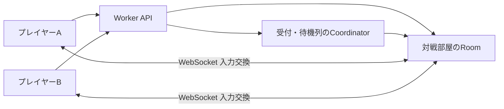

# オンライン対戦の設計

作成日: 2026/9/8。対象コード: `42fca36`。状態: 実装済み。自動検証と公開プレビューでの対戦を確認。スマホ実機確認待ち。

## 1. 目的と範囲

友達をURLで招待する対戦と、待機中の人を組み合わせるランダムマッチを実装する。
両方で共通の対戦部屋を使い、CloudflareのWebSocket中継とロックステップで進行を同期する。
国内回線での操作感を基準にし、Cloudflareの無料枠内で運用する。

秒数や上限のうち、合意事項以外の値は初期案であり、検証後に調整する。

## 2. 合意した仕様

| 項目 | 決定 |
|---|---|
| 対戦の種類 | 招待・ランダムともにカジュアル対戦。レートなし |
| 本人確認 | ログイン不要。匿名IDを端末に保存 |
| 表示名 | 任意入力。未入力は「ゲスト」。端末に保存 |
| 招待 | URLの共有・コピー。両者が準備完了すると開始 |
| ランダム待機 | 待ち時間を表示。キャンセルするまで待機 |
| ランダム開始 | 両者の接続・画面表示を確認して3秒カウントダウン |
| 対戦ルール | 現在の2人対戦と同じ。部屋ごとの設定変更なし |
| 制限時間 | 1試合10分。残り1分から表示し、時間切れは引き分け |
| 再戦 | 両者が希望すると新しい盤面で再戦 |
| 一時停止 | 任意の一時停止なし。設定中もゲームは進む |
| 切断 | 両者のゲームを停止。1人につき1試合で累計15秒の復帰猶予 |
| 切断負け | 猶予を使い切った側の負け。双方の切断など判断不能なら無効 |
| 同期ずれ | 無効試合にして再戦を案内。盤面転送による修復は行わない |
| 縦持ち | 自分の盤面を大きく、相手を小さく表示 |
| 対象回線 | 国内を基準に調整。海外からの参加は制限しない |
| 費用 | 無料枠必須。枠が減ったらランダムの新規受付を先に停止 |

レート、アカウント、機種間の戦績共有、チャット、スタンプ、部屋コード入力、QR表示は初回に含めない。
スコア共有・今日のseed・WebRTCは、この実装には含めない。表示には予測と再計算を使う。

## 3. 既存コードと変更の境界

| 現在の場所 | 確認できた事実 | 変更方針 |
|---|---|---|
| `src/core/game.ts` | `Game.tick(Input[])`で両盤面を進め、おじゃまを送り、勝敗を判定 | `versus`を再利用。通信はcoreの外に置く |
| `src/core/game.ts` | 盤面0はseed、盤面1はseed+1で生成 | 両端末で同じ順序を保持 |
| `src/core/types.ts` | 入力は移動・交換・せり上げ・タッチ座標 | 全項目をフレーム番号とともに送る |
| `src/core/board.ts` | 乱数や攻撃待ちなどprivateな状態がある | 同期検査用の状態出力を明示的に追加 |
| `src/render/input.ts` | `poll()`が押下履歴やキーリピートを消費 | 同じ入力フレームで二度呼ばない |
| `src/render/touch.ts` | ドラッグ判定が表示中の盤面を参照 | 入力遅延が連続スワイプへ与える影響を検証 |
| `src/render/GameScene.ts` | 画面非表示・戻る操作・キーからローカル停止できる | オンライン用の進行制御と設定画面へ分岐 |
| `wrangler.jsonc` | 静的ファイルの配信のみ | API入口とSQLite版Durable Objectsを追加 |
| `.github/workflows/ci.yml` | `versions upload`でプレビューを作成 | 対戦用の状態を本番と分離 |

オンラインは接続形態として扱い、coreの`GameMode`は`versus`を使う。
オンライン用の情報には`roomId`、`matchId`、`localPlayerIndex`を持たせる。
プレイヤー1として参加した端末でも、自分の操作にはP1キーと最初のゲームパッドを使う。
描画順だけ自分を左・大きい側へ変え、coreの盤面番号や勝者番号は入れ替えない。

## 4. サーバー構成

Durable Objectsを以降DOと略記する。

Workerは入力形式と同一オリジンを検査し、接続先へ振り分ける。
`/api/*`だけをWorkerで処理し、ゲームの静的ファイルは既存の配信を維持する。
APIの応答とWebSocket接続をService Workerのキャッシュ対象にしない。
D1は不要。部屋と受付の状態はSQLite版Durable Objectsで管理する。

### 4.1 Coordinator

環境ごとに1つ用意し、匿名セッションの参加先、待機列、試合開始に使う予算を管理する。
同じ匿名セッションが複数の部屋・待機列を同時に占有しないようにする。
待機者にはWebSocketで成立を通知し、短い間隔のHTTPポーリングはしない。

待機列は同じルール・同じゲーム互換バージョンの中で先着順とする。
待機中に画面が隠れた場合は候補から外し、復帰後に待機を継続する。
接続を失った待機者は取り除く。マッチ候補を確保したら参加券を発行する。
部屋への移動に失敗した場合は確保を解除し、接続中の相手を元の待機時刻で戻す。
キャンセルとマッチ成立の競合は受付側で直列化し、同じ人を二組に割り当てない。

### 4.2 Room

1部屋に最大2人。招待・ランダムともに同じ実装を使う。
部屋は参加席、準備状態、seed、入力列、試合状態、復帰猶予、結果を管理する。
ゲームの60fpsシミュレーションをサーバーでは実行しない。
参加・切断・降参・時間切れの裁定は部屋が行う。
通常の勝敗は同一フレーム・同一状態に対する両クライアントの報告で確定する。

招待URLには推測困難な招待トークンを使う。URLを知っている人は参加できる。
参加後に別の再接続トークンを発行する。通常のWebSocket再接続では匿名セッションと参加トークンの両方を照合する。
タブの保存情報を失った場合は、同一オリジンの復旧APIがHttpOnly Cookieの本人識別から参加先を取得する。
画面で明示的に引き継ぐと参加トークンを更新し、古い接続を閉じる。退出は部屋IDとトークン、待機解除は待機IDを照合する。
古い要求は新しい参加を解除しない。再開の応答を失っても、次の参加確認でRoomの最新トークンへ受付記録を修復する。
復旧・退出は対戦の新規受付上限やゲーム互換バージョンによって拒否しない。
ランダム参加券は有効期間を短くし、利用を一度限りにする。参加券は対象部屋とセッションに結び付ける。
トークンはログへ出さず、表示名は装飾やHTMLとして解釈しない。
表示名の初期上限は20文字とし、制御文字と改行を除く。

## 5. 状態遷移と画面

部屋は`waiting → ready → countdown → playing → result`と進む。
`playing`から接続待ちの`suspended`へ移り、復帰すれば`playing`へ戻る。
同期ずれ・サーバー障害は`invalid`、退室や部屋の期限切れは`closed`とする。
すべての更新に状態番号を付け、古い準備完了やカウントダウン通知を無視する。

招待では二人が準備完了した後に3秒カウントダウンする。
ランダムでは接続・互換バージョン・表示状態を確認した後、自動で同じカウントダウンへ入る。
開始前にどちらかが非表示・切断になればカウントダウンを取り消す。
開始確認の初期期限は10秒。期限切れの場合、接続中のランダム待機者は待機列へ戻す。

設定画面を開いても試合は進む。設定画面で盤面操作は受け付けず、保持中の入力を解除する。
「降参」は確認画面を挟み、確定後にサーバーへ送る。オンラインではRキーで再開始しない。
戻る操作も設定画面へ統一し、試合中の明示的な退室は降参として扱う。
画面非表示は切断と同じ復帰猶予を使う。単なるウィンドウのblurと非表示は区別する。

結果には通常勝敗・降参・切断負け・引き分け・無効の理由を表示する。
相手が退出したら再戦待ちを解除する。再戦は新しい`matchId`とseedを発行し、予算を再確保する。
招待の再戦は両者の希望を準備完了として扱う。
ランダムの結果画面には「次の相手を探す」も用意する。

### 5.1 参加状態を見失った場合の復旧

ONLINE起動時と入室・待機の失敗時に、`POST /api/online/recovery`で本人の参加先を確認する。
保存済みのトークンが一致すれば自動再接続し、不一致・保存情報なし・別の招待先なら再開と退出の選択肢を表示する。
`POST /api/online/resume`でこの画面へ引き継ぎ、`POST /api/online/leave`で接続中のWebSocketに依存せず退出する。
退出要求は受付確認までsessionStorageに保持し、応答喪失時は同じ要求を再試行する。API通信は8秒で待ちを打ち切り、再試行を案内する。
待機IDはマッチ成立後の割り当てにも保持し、キャンセルと成立が重なっても対象の参加だけを解除する。
FIND MATCHは`POST /api/queue/status`でゲーム版・既存の参加状態・日次上限・混雑を確認してから接続する。
WebSocketのUpgrade拒否はブラウザから本文を読めないため、即時切断時にも同じHTTP判定で理由を確認する。
旧版ならRELOADを表示し、参加中なら復旧操作へ進み、日次上限ならリセット時刻を案内する。

招待URLの有効期間と席の占有期間は別に扱う。招待部屋の待機・結果画面で切断した席は60秒で解放する。
対戦中の15秒の復帰猶予は変更しない。掃除用alarmに加え、入室・参加照会時にも解放期限を確認する。
受付記録の期限だけでは現役の席を消さず、Roomへ在室を確認する。
サーバーログには`online_resume`、`online_leave`、`online_abandoned_seats`を記録し、Cookie・参加トークン・招待トークンは含めない。

## 6. ロックステップと入力遅延

### 6.1 フレームの確定

サーバーがseed、ルール、席番号、入力遅延D、互換バージョンを通知する。
両端末は同じ`Game({ mode: 'versus', seed, ...rules })`を作る。

入力の初期送信単位は3フレーム、毎秒20通/人とする。何も操作しないフレームも明示する。
最初のDフレームは両者とも`NO_INPUT`とし、入力待ちによる開始不能を防ぐ。
その後はフレームfの入力をf+Dへ割り当てる。
送信済みの入力は変更しない。同じ範囲の再送は内容一致なら受け入れ、不一致なら拒否する。

部屋は両者の入力が揃った連続フレームだけを順に配信する。
勝敗・同期検査に使う確定盤面は、自分の入力もサーバーで確定した列から適用する。表示用の盤面では自分の入力を即座に適用する。
確定盤面では未着の入力を`NO_INPUT`で代用しない。表示用の盤面だけは相手の未着入力を`NO_INPUT`として予測し、到着後に再計算する。
停止中は新しい入力の先行蓄積に上限を設け、復帰時の連続交換を防ぐ。
捕捉済み入力は一度だけ送信し、停止中の未捕捉の押下・ドラッグは解除する。

### 6.2 遅延の決め方

TODOの3〜4フレームは確定値にしない。
3フレーム分の送信待ちに加え、入力が中継されて戻る時間を吸収する必要がある。
接続時に往復時間とばらつきを測り、両者共通のDを開始前に決める。
初期検証ではD=6フレーム（100ms）を基準に、4・6・8フレームを比較する。
試合途中にはDを変更しない。遅延増加時は入力待ちとなる。

確定済み入力を追い掛ける再生は、1回の描画で処理するtick数に上限を設ける。
復旧再生中は演出を抑止し、音や振動がまとめて発生するのを防ぐ。
タッチの座標は操作を捕捉した時点のセル座標とし、適用時に都合よく再解釈しない。
せり上がり・落下・連続スワイプが遅延下でも意図どおり動くかを実機で確かめる。

### 6.3 同期検査と勝敗

120フレームごとを初期値として、同じ確定フレームの状態ハッシュを交換する。
セルだけでなく、乱数状態、次の行、タイマー、攻撃待ち、連鎖、得点、速度、勝敗を含める。
ハッシュ用の順序と数値表現を固定し、描画オブジェクトや音の状態は除外する。

通常終了時は最終フレームのハッシュと結果が両者で一致した後に結果を確定する。
食い違えば無効試合とする。片方の自己申告だけで勝ちにしない。
片方が無応答なら復帰猶予の規則へ移し、サーバー障害や双方無応答は無効とする。
サーバーはゲームを再計算しないため、改造クライアントや自動操作への完全な対策にはならない。

## 7. 切断・復帰・時間制限

サーバーは明示的な非表示通知、WebSocket切断、入力・進行確認の停滞から中断を検出する。
試合中の進行確認は入力メッセージに同梱し、余分な毎フレーム通信を増やさない。
中断検出の初期値は1秒。入力が揃わない時点でクライアントは先に停止する。
猶予はサーバーの時刻で管理し、再送や再接続で15秒へ戻さない。履歴再生中も猶予を消費する。

復帰時は、クライアントが再接続トークンと最後に適用したフレームを送る。
クライアントにGameが残っていれば欠けた確定入力だけを再生する。
ページを再読み込みした場合はseedから入力履歴を再生する。盤面スナップショットの転送は不要。
再生後の共通フレームのハッシュ一致を確認してから対戦を再開する。
同期ずれを修復するための再生はせず、検査に失敗したら無効試合とする。

10分はゲームが進む時間として扱い、復帰待ちは含めない。
36,000tickとサーバー側の進行時間上限を併用し、入力を極端に遅く送って長時間占有することを防ぐ。
細かな通信停滞が重なり、ゲーム内では10分未満でも、サーバー時刻で管理する期限に達した場合は引き分けにする。
両者の猶予を合わせて最大30秒を見込み、準備・後処理を含む部屋の稼働予算を確保する。
通常終了と時間切れが競合した場合、締切前に部屋が受理した一致済みの終了報告を優先する。

## 8. 無料枠と受付制御

### 8.1 公開値と前提

2026/9/8に確認した公開値では、Durable ObjectsのFreeはSQLite版のみ利用できる。
日次上限はリクエスト10万、実行時間13,000 GB秒。受信WebSocketは20通で1リクエスト換算となる。
SQLiteの書き込みは10万行/日、読み取りは500万行/日、保存容量は合計5GB。
削除とAlarmの設定も書き込みに数える。日次枠はUTC 0時（日本時間9時）にリセットされる。
上限超過時は該当操作が失敗する。[Durable Objects料金](https://developers.cloudflare.com/durable-objects/platform/pricing/)

Worker側にも10万リクエスト/日のFree上限がある。
他のWorkerを含むアカウント全体の利用を考慮する。[Workers制限](https://developers.cloudflare.com/workers/platform/limits/)

本番アカウントがWorkers Freeであることを公開前に確認する。
有料プラン内の無料割当を使うだけでは、追加課金ゼロを保証できない。
本設計の受付カウンターはCloudflareの請求メーターと同じものではない。
他サービスの利用や不正な大量接続まで含めて、招待用の残量を完全に保証することもできない。

### 8.2 1試合の見積もり

3フレームずつ送ると、10分で`20通 × 2人 × 600秒 = 24,000通`。
入力受信だけなら`24,000 / 20 = 1,200リクエスト相当`になる。
制御・開始・復帰分を含め、初期案は1試合1,500リクエスト相当を予約する。
毎フレーム送信すると入力分だけで3,600となるため、3フレーム単位を維持する。

実行時間は休止による節約を当てにせず、部屋が660秒稼働するケースを上限として見積もる。
`660 × 0.128 = 84.48 GB秒`を切り上げ、1試合90 GB秒を予約する。
これはCPU処理時間ではなく、割り当てメモリ量と稼働時間の積である。

入力を1メッセージごとに1行保存すると24,000行となり、書き込み枠が先に尽きる。
初期案では部屋を試合中は稼働させ、確定入力をメモリへ保持し、1秒単位でまとめて保存する。
600回の書き込みと削除・状態更新を含め、初期予算を1試合3,000行とする。
この数値は実装でのSQL・索引・Alarm回数を計測してから確定する。

待機中はHibernation WebSocket APIを使う。
試合中に休止させない設計とした場合、その稼働時間を上記予算へ含める。
[WebSocketの公式資料](https://developers.cloudflare.com/durable-objects/best-practices/websockets/)

### 8.3 予算の予約と招待優先

Coordinatorは試合開始前に、UTC日付ごとのリクエスト・実行時間・書き込み予算をまとめて予約する。
初期のアプリ内上限はそれぞれ60,000リクエスト、8,000 GB秒、60,000書き込み行/日とする。
残りは待機・接続・読み取り・障害時の余裕として残す。読み取り量と保存容量も別途監視する。

各予算の25%を招待専用として残す。ランダムは75%の境界を越える予約を拒否し、招待は全体上限まで使える。
制御用の書き込みを除くと、書き込み予算から理論上最大20試合/日、すべてランダムなら最大15試合/日となる。実際の受付数は制御用の利用量によって少なくなる。
途中終了でも当日は予約を返さない。再戦も1試合として予約し、二重開始は`matchId`で防ぐ。
日付をまたぐ可能性のある試合は両日の予算を確保する。

部屋作成数・同時接続数・再接続回数にも制限を設ける。
長時間待機中の接続確認の通信量を別に計上し、枠が不足すれば待機を終了して受付停止を案内する。
「キャンセルまで待機」はサービス稼働中の仕様であり、無料枠超過や障害を越えて接続し続ける保証ではない。
入力の頻度・サイズ・先行フレーム数を制限する。不正な送信も受信時点の利用量は発生し得る。

### 8.4 保存と障害時の扱い

永続化するのは部屋の制御状態、期限、入力履歴のまとまり、日次予算、最小限の結果とする。
初期の部屋有効期間は無人・結果待ちで10分、診断情報の保持は24時間とする。
表示名やトークンを診断情報へ入れず、保存データは期限後に削除する。

試合中に部屋の実行環境が再起動した場合は、サーバー障害として無効試合にする。
最後の保存後に配信した入力の有無を確実に判断できないため、途中から試合を継続しない。
クライアントの切断・再読込には、稼働中の部屋が保持する確定入力から復帰する。

## 9. APIと通信形式の案

| 経路 | 役割 |
|---|---|
| `POST /api/session` | 匿名セッションと認証情報を発行 |
| `POST /api/rooms` | 招待部屋とURLを作成 |
| `POST /api/rooms/:id/join` | 招待トークンを検査して席を確保 |
| `GET /api/queue/ws` | 待機・キャンセル・マッチ通知 |
| `GET /api/rooms/:id/ws` | 参加・復帰・準備・入力・結果・再戦 |
| `GET /api/online/status` | 受付可否と再開予定を表示 |

ブラウザ標準WebSocketで使える認証方法を選ぶ。
同一オリジンのSecure・HttpOnly Cookieを基本にし、再接続トークンは最初の認証メッセージで送る。
認証完了前は操作を処理せず、短い期限で閉じる。URLクエリに長命の秘密を載せない。

共通情報は`protocolVersion`、`gameVersion`、`roomId`、`matchId`、状態番号、メッセージ種別。
入力は`startFrame`と連続した`Input[]`、最後の適用フレームを含む。
フレーム番号は有限の整数、方向は-1/0/1、操作はboolean、座標は盤面範囲内に制限する。
部屋が席番号を割り当て、クライアントからの他人の席番号は信用しない。

メッセージ種別は`hello / ready / visibility / input / ack / hash / resume / surrender / rematch / leave`を基本とする。
サーバー応答は`joined / countdown / frames / suspended / resumed / result / closed / error`とする。
重複・古い試合ID・未来過ぎる入力・巨大な配列・NaN・互換性不一致を明示的に拒否する。

## 10. 実装の分割と検証

1. `src/net/`に通信型、入力バッファ、進行制御を追加する。coreには状態ハッシュ用の出力だけを足す。
2. `worker/`にWorker入口、Coordinator、Room、永続化と予算制御を実装する。
3. 招待ロビーとオンライン用GameSceneをつなぎ、2ブラウザで対戦・切断・復帰を確認する。
4. 同じ部屋実装へランダム待機列を接続し、競合・キャンセル・再戦を確認する。
5. スマホ実機、費用計測、プレビューと本番の分離を確認して公開する。

### 必須テスト

- 同じseed・入力列で両端末の全状態が一致する。入力の欠番・重複・再送でも二重適用しない。
- 入力停止中に`poll()`を繰り返し消費せず、復帰時にスワイプやせり上げが暴発しない。
- プレイヤー0/1のどちらでも、自分だけを操作し、勝敗と名前を正しく表示する。
- 同時参加・キャンセル・二重タブ・再戦の競合で三人入室や予算の二重予約が起きない。
- 画面非表示・突然の通信断・再読込から復帰できる。累計15秒を超えた側だけが負ける。
- 同期ずれ・両者切断・DO再起動・履歴不足を無効試合として扱う。
- 10分で引き分けになり、復帰待ち・終了報告との競合でも結果が二重確定しない。
- UTC日付境界、枠不足、再戦、受付停止で予算を越える予約が成立しない。
- メッセージ数・SQL読み書き・Alarm回数を10分対戦で実測し、予約額以下であることを確認する。

`pnpm typecheck`、`pnpm test`、ポートを分けた`pnpm e2e`を実行する。
WorkerのテストにはローカルDurable Objects環境を追加し、E2Eは実際のWebSocketへ接続する。
不具合修正は、新しいテストが修正前のコードで失敗することを確認する。
バランス自体は変更しない。変更が必要になった場合は既存のシミュレーションで前後を測る。

### 実機での公開判定

国内Wi-Fi同士とWi-Fi対モバイル回線で、入力遅延・停止回数・復帰時間を記録する。
人工的な遅延は往復40/100/200msとばらつきを加え、操作感と停止頻度を比較する。
これらは検証条件であり、国内回線の実測値ではない。
縦持ち・横持ち・回転、タッチ連続交換、せり上げ、画面オフを確認する。
プレビューのビルド識別子を確認し、ユーザーのスマホ確認後にmergeする。

## 11. 公開前に検証・設定すること

### 検証して確定すること

- Freeプランであること、同じアカウントの他サービスが使う枠、既存の実利用量を確認する。
- 3フレーム送信と入力遅延がタッチ操作に適するかを測る。成立しなければ方式の判断を再確認する。
- SQL・索引・削除・Alarm込みで予約量を測定し、アプリ内上限を調整する。
- 10分分の履歴再生がスマホで復帰猶予内に終わるかを測る。
- `versions upload`だけでDOの初回マイグレーションを扱えると仮定しない。初回導入手順を公式仕様とローカル検証で確定する。

### 公開環境へ実装・設定すること

- プレビュー専用WorkerとDO名前空間を用意し、本番の部屋・待機列・予算を共有しない。
- クライアントの`gameVersion`が一致する相手だけを接続する。PWAの旧版には更新を案内する。
- デプロイ中の旧接続の扱いを検証し、対応できない再起動は無効試合として案内する。

ユーザーに再確認するのは、無料運用や操作感など合意済みの要件が成立しない場合に限る。
未検証の通信遅延や利用可能試合数を、公開時の保証として表示しない。

## 12. 実装と運用

| 場所 | 実装内容 |
|---|---|
| `src/net/` | 通信形式、状態ハッシュ、入力バッファ、再接続 |
| `worker/` | 受付、予算予約、部屋の状態遷移と永続化 |
| `src/render/OnlineScene.ts` | 招待、ランダム待機、盤面、結果・設定画面 |
| `tests/net/` | 同期、欠番、再送、切断、予算、遅延中のドラッグのテスト |
| `e2e-online/` | ローカルDOとWebSocketを使う複数ブラウザのテスト |

ローカル起動は`pnpm build`の後に`pnpm dev:online`。ポート8788で開く。
`pnpm e2e:online`は保存領域を分離したWorkerを起動し、終了時にプロセスを止める。
通常の`pnpm e2e`は既存モードの回帰テストとして残す。
10分間の通信・保存量の計測は`ONLINE_BENCHMARK=1 pnpm e2e:online e2e-online/budget.spec.ts`で実行する。

Workers Freeの利用は2026/9/8にユーザーへ確認済み。契約情報APIは権限不足で取得できなかった。
受付の緊急停止は`wrangler.jsonc`の`ONLINE_ENABLED`を`false`にして再デプロイする。
静的なゲーム配信は引き続き利用できる。プレビューと本番はアカウントの日次無料枠を共有するため、試験対戦の使用量も考慮する。

DOの初回作成は`versions upload`では適用されない。CIでは`wrangler deploy`を使い、PRごとの専用Workerへ公開する。
`tools/prepare-preview.mjs`が本番ルートを除いた設定を生成する。Worker名は`swaprise-pr-<PR番号>`。
Workerは自動削除しない。本番への導入はCIとスマホ確認後のmergeで行う。
[CloudflareのDO作成・変更仕様](https://developers.cloudflare.com/durable-objects/reference/durable-objects-migrations/)

互換性を変えるcore・通信処理の修正では`GAME_VERSION`を更新する。異なる版のクライアント同士は対戦させない。
入力遅延は接続時に3回測った最大RTTから決め、6〜18フレームの範囲で両者に揃える。
範囲を越える遅延では入力待ちが増える。試合中には遅延幅を変更しない。

### 検証記録（2026/9/9）

- `pnpm typecheck`と単体試験114件が通過。
- 専用ポートで既存モードのブラウザ試験40件が通過。
- オンライン対戦のブラウザ試験11件が通過。招待、再戦、ランダム、切断復帰、二重参加の拒否、同期ずれ、スマホ表示を確認した。追加した退室競合の回帰試験も単独で通過し、CIでは計12件を実行する。
- 人工的な往復遅延40/100/200msと片道0〜10msの揺らぎを加え、それぞれ入力遅延8/13/18フレームで両端末が600フレームを超えて進むことを確認した。ホストの実行負荷も含む試験であり、国内回線の実測値ではない。
- NodeのWebSocketクライアントとローカルDOで10分間の計測が通過。両端末が35,067フレームで時間切れの引き分けになった。
- Roomへの受信は23,374通、保存処理は1,200回、履歴の保存単位は598個。定期ハッシュ・pingを720通、接続などを10リクエスト分加えると1,214.7リクエスト相当となり、予約1,500以内。保存1,200回＋履歴削除598個＋その他10行は1,808行相当で、予約3,000以内だった。
- 上記はアプリ内の処理回数による確認で、Cloudflareの請求メーターを直接計測した値ではない。実行時間は660秒×0.128GB＝84.48GB秒を想定して90GB秒を予約する。公開後も実際の利用量を確認する。
- 公開プレビューでも2ブラウザで招待対戦・降参・再戦が通過。
- スマホ実機での操作感、Wi-Fiとモバイル回線間の対戦、長い履歴からの復帰時間は未確認。

### 操作の即時反映とスマホ表示（2026/9/9）

自分の操作は、ローカル対戦と同じく次の60Hzのtickで表示用の盤面に適用する。
3フレーム分の送信待ちやサーバー往復は表示の条件にしない。
従来のDは確定待ちを吸収する猶予として残し、表示用の盤面はその先を進める。

`src/net/prediction.ts`は自分の未確定入力を保持する。確定フレームが進んだら、確定盤面を表示用の盤面へ複製し、残る入力を再適用する。
相手の未着入力は操作なしと仮定するため、相手のおじゃまや速度変化が届いた際には表示が補正される。
通信停止中の先行入力には引き続き上限を設ける。回線が途絶えた場合まで操作を続けられるわけではない。

勝敗の報告と状態ハッシュには予測盤面を使わない。自分の交換音や振動は操作時に出し、再計算した過去のイベントは再生しない。
タッチも表示用の盤面を参照し、入れ替え後に次の交換を待つ時間をローカルと揃える。
通信量・保存頻度は変更しない。

オンライン画面の文言は英語に統一する。フォント・見出し・主操作の文字サイズは既存メニューと共通にし、同じ論理画面の倍率で拡大する。ボタンの幅には上限を設け、横向きでは見出しと操作を左右に配置する。
横持ちで高さが足りなければスクロールできるようにし、文字を縮めて収めない。
